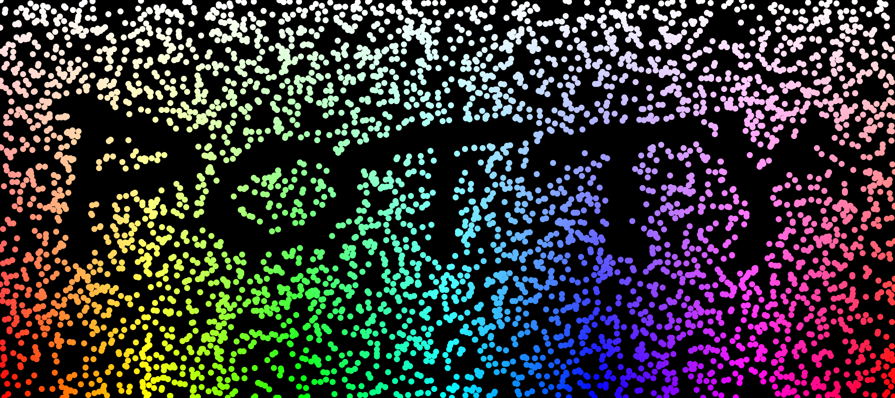

# Arts Homeworks

Some stuff I generated for school art homework because I was too lazy to draw by hand.

## Text

 > Create word art in a way that the meaning of the word is reflected in the style of the work.

I chose the Hungarian word "pötty" meaning dot.

## Opacity

 > Use opacity as the main tool for creating the work.

I wasn't quite sure what that meant but I came up with this.

## How to run it

If you aren't lazy use a proper IDE.

Otherwise:
```sh
javac -d bin -cp src "src/com/bacskai/arts/${p}/${P}.java" &&
    java -cp bin "com.bacskai.arts.${p}.${P}"
```
Where `${p}` and `${P}` are the lower and uppercase names of the given project (they should have the same name). 

Outputs should be in the `res` folder.
